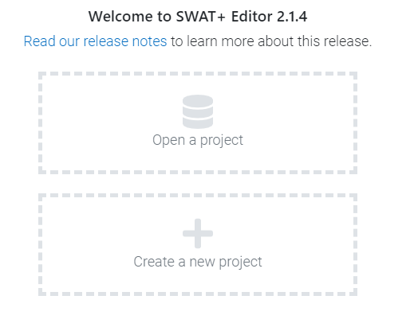
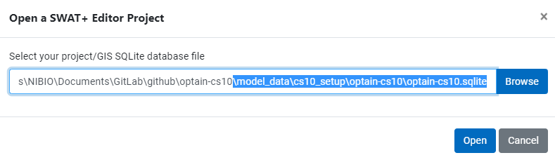
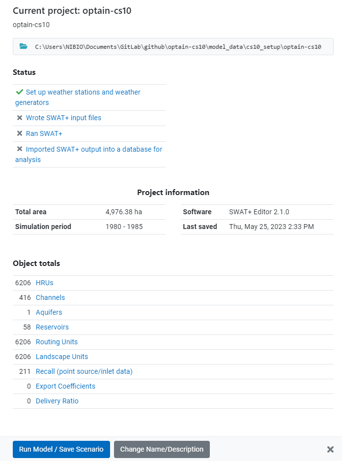
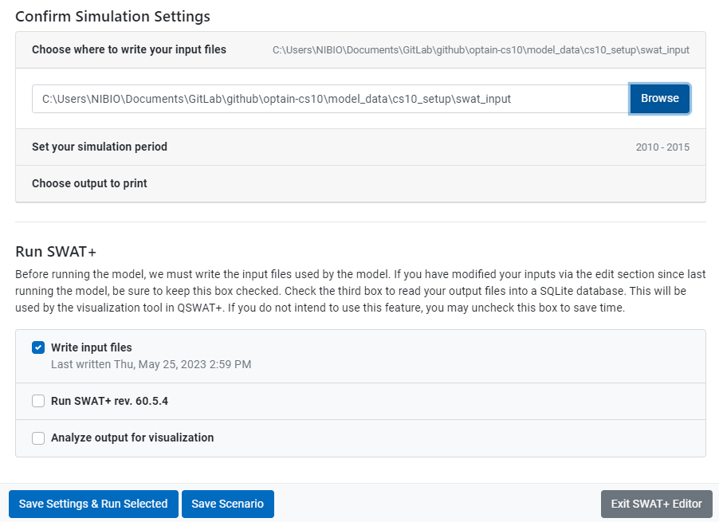

# Writing SWAT+ Input Files

The SWATBuildR cannot write the actual text files for our model setup, we have to use the SWAT+ Editor for this. Once the input files have been written, we will try to **ONLY modify these parameters with R** and **never edit parameters in the Editor**. The reason for this is because changing the values of the text files will **not** change the values of the `sqlite` database. If the input files are re-written by the editor, our changes to the text files will be **overwritten**.

## Loading the project in SWAT+ Editor







1.  After clicking on the Run Model / Save Scenario button, you arrive at the "Confirm Simulation Settings" page. Here you need to choose where to write your input files. We have chosen `cs10_setup/swat_input`.
2.  We have also changed our simulation time period, but this is not required.
3.  Make sure to un-check "Run SWAT" and "Analyze output for visualization"
4.  "Save settings & Run Selected"



Your SWAT+ input files will be generated, and you will be prompted to Save Scenario. **This is not recommended**, because in our testing, the scenario saving would recursively generate new scenarios within the same folder, until all file space had been exhausted on the drive. This extremely deep folder **brings windows to its knees**, even when trying to delete it using explorer (Use Powershell instead).

[Option to save scenario. Not Recommended.](figures/all_tasks_done.png)

## SWAT+ Test Run

We will copy in our SWAT+ executable, our input files, and our weather files into a folder and run SWAT+ as a test.

> For some reason, when writing the SWAT+ input files, it does not write the weather station data. I am not sure if this is intended or not. the SWAT+ model still runs fine, however maybe it is using the weather generator? The meteo input fles are located in the same directory as the `sqlite`, probably because `svatools` put them there? #TODO

Our current SWAT+ version is `rev60.5.4_64rel.exe` but this is **subject to change**

Make a run directory and enable code running.

```{r}
# if set to true, following code will be evalutated. 
post_editor = TRUE

dir.create("model_data/cs10_setup/run_swat", showWarnings = F)
```

Copy all required files into this directory:

```{r, eval=post_editor}

sta_files <- list.files("model_data/cs10_setup/optain-cs10/",
             pattern = "sta_", full.names = T)

cli_files <- list.files("model_data/cs10_setup/optain-cs10/", 
                        pattern = ".cli", full.names = T)

input_files <- list.files("model_data/cs10_setup/swat_input/", 
                       full.names = T)

path_to_swat <- "model_data/cs10_setup/rev60.5.4_64rel.exe"


source_files <- c(sta_files, cli_files, input_files, path_to_swat)


status <- file.copy(from = source_files,
                    to = "model_data/cs10_setup/run_swat/",
                    overwrite = T)
```

Lets run some checks on these files

```{r, eval=post_editor}

if(any(status == FALSE)){
  warning("Some files were not copied:")
  print(source_files[which(status==FALSE)])
}

print(
  paste(
    length(which(status)),
    "of",
    length(source_files),
    "files were copied into the run folder, amounting to a size of ",
    round(sum(file.info(source_files)$size * 1e-6), 2),
    "megabytes"
  )
)
```

Now lets run the model to make sure it works

```{r, test_swat_1, eval=post_editor}
# update time sim
time_sim <- readLines("model_data/cs10_setup/run_swat/time.sim")
time_sim[3] <- "       0      2010         0      2011         0  "
writeLines(text = time_sim, con = "model_data/cs10_setup/run_swat/time.sim")

msg <- processx::run(command = "rev60.5.4_64rel.exe",
              wd = "model_data/cs10_setup/run_swat/")


simout <- readLines("model_data/cs10_setup/run_swat/simulation.out")

cat(tail(simout), sep = "\n")
```

It will be useful to test SWAT+ along our journey, so we will reuse this code in the function `test_swat()`

```{r}
source("model_data/code/test_swat.R")
```

We can now continue with our final buildR step

## Link aquifers and channels with geomorphic flow

A SWATBuildR model setup only has one single aquifer (in its current version). This aquifer is linked with all channels through a channel-aquifer-link file (`aqu_cha.lin`) in order to maintain recharge from the aquifer into the channels using the geomorphic flow option of SWAT+.

The required input file cannot be written with the SWAT+Editor. **Therefore it has to be generated in a step after writing the model text input files with the SWAT+Editor.**

Path of the `TxtInOut` folder (project folder where the SWAT+ text files are written with the SWAT+Editor)

```{r}
txt_path <- 'model_data/cs10_setup/swat_input/'

```

Linking the aquifer to the channels

```{r, eval=run_code}
project_path <- 'model_data/cs10_setup'
project_name <- 'optain-cs10'
source('model_data/swat_buildR/init.R')

link_aquifer_channels(txt_path)
```

This created the file `aqu_cha.lin` and changed `file.cio` to point to it (row 16, column 3)

Let us test to see if SWAT+ still runs

```{r,running_swat, eval=post_editor}
simout <- test_swat()

cat(tail(simout), sep = "\n")
```

Success.

```{r}
# remove the swat+ run
unlink("model_data/cs10_setup/run_swat/", recursive = T)
```
