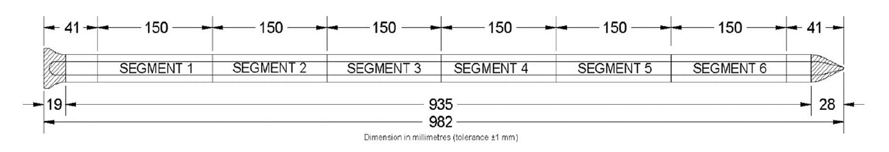
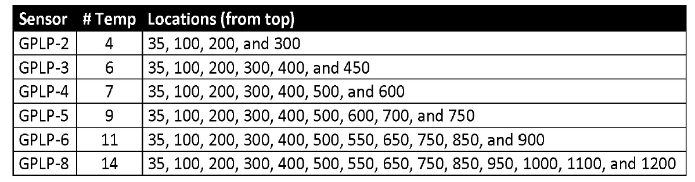

# Field Site Loggers

## Introduction

This chapter is concerned with preparing the measured data for the OPTAIN field scale models. This will involve loading the data, transforming it into a usable format, and performing a quality check. The end of this chapter will result in data fit for use in SWAP as well as a tangentially related antecedent precipitation index (API) model for use in the SWAT+ modelling work, related to scheduling management operations using SWATFarmR .

### Prerequisites

The following packages are required for this chapter:

```{r, message=FALSE}
require(readr) # for reading in data
require(dplyr) # for manipulating data
require(stringr) # for manipulating text
require(purrr) # for extracting from nested lists
require(plotly) # for diagnostic plotting
require(lubridate) # for date conversions
require(reshape2) # for data conversions
require(wesanderson) # plot colors
require(DT) # for tables
require(mapview) # for plotting
require(sf) # for shapefiles

show_rows <- 500 # number of rows to show in the tables
```

As well as the following custom functions:

```{r}
source("model_data/code/plot_logger.R")
```

### Locations

The loggers are described as such:

1.  Logger3(600409): deep rocky sand (forest?)

2.  Logger4(600410): Tormods farm (agri)

3.  Logger2(600411): John Ivar lower area (agri)

4.  Logger1(600413): John Ivar behind the barn (agri)

And are located here:

```{r}

field_sites_shp <- read_sf("model_data/field_sites/geospatial/cs10_field_sites.shp")
basin_shp <- read_sf("model_data/input/shape/cs10_basin.shp")

basin_map <- mapview(basin_shp, alpha.regions = .1, legend = FALSE)
field_map <- mapview(field_sites_shp, legend = FALSE)

basin_map+field_map

```

## Loading in observed data.

To start we need to load in our data from the *GroPoint Profile* data loggers. The logger is approx. 1m long and has 7 temperature sensors, and 6 soil moisture sensors located along its segments. @gropoint2023

```{r, echo = FALSE, fig.align='center', fig.cap= "GroPoint Segment Schematic (GroPoint Profile User Manual, Page 6)"}

```

```{r, echo = FALSE, fig.align='center', fig.cap= "GroPoint Temperature sensor depths. We use GPLP-4 with seven temperature sensors. (GroPoint Profile User Manual, Page 6)"}

```

The logger data has been modified before import into R. The file names have been changed and column headers have been added. Missing values stored as "Error" have been removed.

Columns headers have assigned with variable name, depth, and unit of depth separated by an underscore.

```{r}
path <- "model_data/field_sites/loggers/data/"
```

Loading the data and modifying it is performed with `readr` and `dplyr`.

```{r}
# list of files
datasheets <- list.files(path, full.names = TRUE)

# loading in the data, with an ID column 'source'
data <- read_csv(datasheets, show_col_types = F, id = "source")

# translating the source text to logger ID
data$site <- data$source %>% str_remove(path) %>% str_remove(".csv") %>%
  str_split("_") %>% map(1) %>% unlist()

# removing the source column
data <- data %>% select(-source)

# removing duplicates
data <- data %>% distinct()
```

Data preview

```{r, echo=FALSE}
datatable(
  head(data, show_rows),
  extensions = "Scroller",
  options = list(scrollY = 200, scroller = TRUE)
)
```

We need to force the date time column into the correct format. We can do this with the following command. (*Please note, this has been done for region:* `United States` *this code may need to be adjusted to fit your regional settings*)

```{r}
data$datetime <- data$datetime %>% 
  as_datetime(format = "%m/%d/%Y %H:%M", tz = "CET")
```

## Data Re-structuring

For ease of use in R, we will re-structure the data to be in "tidy" format (Read more: [@wickham2014]).

```{r}
# grab the measured variable column headers
mea_var <- colnames(data)[3:15]

# melt (tidy) the data by datetime and site. 
data_melt <- data %>% melt(id.vars = c("datetime", "site"),
                           measure.vars = mea_var)

# parse out the variable
data_melt$var <- data_melt$variable %>% str_split("_") %>% map(1) %>%
  unlist()

# parse out the depth of measurement
data_melt$depth <- data_melt$variable %>% str_split("_") %>% map(2) %>%
  unlist()

# remove duplicates
data_melt <- data_melt %>% distinct()

```

Data preview:

```{r, echo=FALSE}
datatable(
  head(data_melt, show_rows),
  extensions = "Scroller",
  options = list(scrollY = 200, scroller = TRUE)
)
```

### Summarize to Daily Means

As SWAP is a daily time step model, we do not need the hourly resolution, and can therefore simplify our analysis. We first need to parse out a (daily) date column

```{r}
data_melt$date <- data_melt$datetime %>% as.Date()
```

And then group the data by this date, followed by an averaging function.

```{r}
daily_data <- data_melt %>% group_by(date, var, depth, site) %>%
    summarise(value = round(mean(value, na.rm = TRUE), 1), .groups = "drop_last") %>% ungroup()
```

Additional notes:

-   The values are rounded to one decimal place, as this is is the precision limit of the Logger.

-   The averaging is performed per date, variable, depth, and site (for obvious reasons)

-   The functionality of `.groups = "drop_last"` is unknown to me, however it does not change anything other than quieting a warning message.

-   The data is "ungrouped" at the end, to avoid problems with plotting the data (with plotly) later on.

Data preview:

```{r, echo=FALSE}
datatable(
  head(daily_data, show_rows),
  extensions = "Scroller",
  options = list(scrollY = 200, scroller = TRUE)
)
```

### Including Air Temperature and Precipitation Data

We are going to add the temp / precipitation data from out SWAT+ setup to give us insight on temperature and moisture dynamics for the data quality check.

Also important to note, is that all this code is only necessary, because of the strange format SWAT+ uses for its weather input. If it would just use a standard format (like everything else) then all this would not be needed.

Reading in the SWAT source precipitation data:

```{r}
# TODO remove temp
swat_pcp <- read.table("model_data/cs10_setup/temp_sta_id1.pcp", skip = 3, header = F, sep = "\t") %>% as_tibble()

swat_tmp <- read.table("model_data/cs10_setup/temp_sta_id1.tmp", skip = 3, header = F, sep = "\t") %>% as_tibble()
```

Data preview:

```{r, echo=FALSE}
datatable(
  head(swat_pcp, show_rows),
  extensions = "Scroller",
  options = list(scrollY = 200, scroller = TRUE)
)
```

Parsing out the first and last day and year.

```{r}
FIRST_DOY <- swat_pcp[1,][[2]]-1
FIRST_YEAR <- swat_pcp[1,][[1]]

LAST_DOY <-  swat_pcp[length(swat_pcp$V1),][[2]]-1
LAST_YEAR <- swat_pcp[length(swat_pcp$V1),][[1]]
```

Converting these to an R format. Note that R uses a 0-based index *only for* dates. (very confusing!).

```{r}
first_day <- as.Date(FIRST_DOY, origin = paste0(FIRST_YEAR, "-01-01"))
last_day <- as.Date(LAST_DOY, origin = paste0(LAST_YEAR, "-01-01"))

date_range <- seq(from = first_day, to = last_day, by = "day")
```

Creating a dataframe from the source data

```{r}
pcp_data <- tibble(date = date_range, pcp = swat_pcp$V3)
```

And filtering it to only cover the same range as our logger data.

```{r}
pcp_data <- pcp_data %>% filter(date %in% daily_data$date)
```

And we do the same for temperature

```{r}
FIRST_DOY <- swat_tmp[1,][[2]]-1
FIRST_YEAR <- swat_tmp[1,][[1]]
LAST_DOY <-  swat_tmp[length(swat_tmp$V1),][[2]]-1
LAST_YEAR <- swat_tmp[length(swat_tmp$V1),][[1]]
first_day <- as.Date(FIRST_DOY, origin = paste0(FIRST_YEAR, "-01-01"))
last_day <- as.Date(LAST_DOY, origin = paste0(LAST_YEAR, "-01-01"))
date_range <- seq(from = first_day, to = last_day, by = "day")
tmp_data <- tibble(date = date_range,
                   tmp_max = swat_tmp$V3,
                   tmp_min = swat_tmp$V4)
tmp_data <- tmp_data %>% filter(date %in% daily_data$date)
```

```{r, echo = F, fig.align='center', fig.cap= "Temperature range and precipitation for CS10"}

yrange <- c(pcp_data$pcp, tmp_data$tmp_max, tmp_data$tmp_min)

ylimits <- c(min(yrange, na.rm = T), max(yrange, na.rm = T))

par(mar = c(5, 4, 4, 4) + 0.3)  # Additional space for second y-axis
plot(
  tmp_data$date,
  y = tmp_data$tmp_max,
  col = "red",
  type = "l",
  ylab = "\U00B0 C", axes = F,
  xlab = "Date",
  ylim = ylimits
)


par(new = TRUE)                             # Add new plot
plot(
  tmp_data$date,
  y = pcp_data$pcp,
  col = "black",
  type = "h",
  main = "CS10-SWAT Climate",
  ylab = "",
  xlab = "Date",
  ylim = ylimits
)
lines(tmp_data$date, y = tmp_data$tmp_min, col = "blue")

axis(side = 4, at = pretty(range(pcp_data$pcp)))     
mtext("mm", side = 4, line = 3)  
```

Note: this does (yet) include data from 2023, even though the loggers do.

## Data quality check

In this section we are proofing the quality of the data.

### Logger 600409 "Deep Rocky Sand"

```{r, fig.align='center', fig.cap= "Logger 600409"}
plot_logger(daily_data, "600409", pcp_data, tmp_data)
```

#### Soil Temperature

-   Remove first few days with unrealistic data

#### Soil Moisture Content

-   First few days need to be removed
-   150mm depth seems usable before Sept2022 -- However Attila (instrument installer) mentioned this sensor might be in the air (which would explain low moisture levels), so potentially useless
-   350mm depth seems usable, breaks around/after Sept2022
-   450mm depth seems useless, constantly getting wetter for an entire year, spiking post Sept2022
-   600mm depth seems useless, constantly getting wetter for an entire year, spiking post Sept2022
-   750mm depth seems useless, constantly getting wetter for an entire year.
-   900mm depth seems useless, constantly getting wetter for an entire year.

### Logger 600410 "Tormods farm"

```{r, fig.align='center'}
plot_logger(daily_data, "600410", pcp_data, tmp_data)
```

#### Soil Temperature

-   Remove first few days with unrealistic data

#### Soil Moisture Content

-   First few days need to be removed
-   Depth 150 probably useless, as sensor is in free air. (According to Attila)
-   Logger seems to have broken Sometime after Sept1 2022, for all depth levels.
-   Data pre-Sept22 seems usable (Csilla ?)

### Logger 600411 "John Ivar Lower Area"

```{r, fig.align='center'}
plot_logger(daily_data, "600411", pcp_data, tmp_data)
```

#### Soil Temperature

-   Need to remove the first few days
-   Need to remove the malfunction in April-May 2022

#### Soil Moisture Content

-   First few days need to be removed
-   Need to remove the malfunction in April-May 2022
-   Depths 150 is out of soil, must be removed.
-   Logger seems to have broken August 16th, 2022, data seems useful before that date (Csilla, agree?)

### Logger 600413 "John Ivar behind the barn"

```{r}
plot_logger(daily_data, "600413", pcp_data, tmp_data)
```

#### Soil Temperature

-   Remove the first few days with unrealistic data

#### Soil Moisture Content

-   Remove first few days
-   Remove 150mm, seems out of earth
-   Hard to tell when sensor broke, earliest June 24th, latest Sept.12 2022, what do you think Csilla ?

## Data Cleanup

### General cleanup

Removing the first few days of the simulation

```{r}
start_date <- "2021-11-01"
data_clean <- daily_data %>% filter(date > start_date) 
```

To be on the safe side, I am setting the logger cut-off date to XXXXXXXXX This could be tuned "per logger" later on if one feels confident.

```{r}
cut_off_date <- "2022-08-14"
data_clean <- data_clean %>% filter(date < cut_off_date) 
```

And we will do the same for the climate data

```{r}
pcp_data_clean <- pcp_data %>% filter(date > start_date) 
pcp_data_clean <- pcp_data_clean %>% filter(date < cut_off_date) 

tmp_data_clean <- tmp_data %>% filter(date > start_date) 
tmp_data_clean <- tmp_data_clean %>% filter(date < cut_off_date) 
```

We will remove the 150 mm depth SMC measurement, as it was not submerged properly in the soil, and is therefore of little use. The temperature reading might be useful, so we will keep it.

```{r}
data_clean <- data_clean %>% filter(depth != "150") 
```

### Logger specific cleanup

#### Logger 600409

No logger specific cleanup required

#### Logger 600410

No logger specific cleanup required

#### Logger 600411

Logger 600411 needs temperature and SMC data removed from 2022-04-21 to 2022-05-10. It seems like the logger was removed from the soil.

```{r}
# define time range to remove
remove_dates <- seq(from = as.Date("2022-04-21"),
                    to = as.Date("2022-05-10"),
                    by = "day")

# set values in that site and date range to NA
data_clean <- data_clean %>%
  mutate(value = case_when((site == "600411" &
                              date %in% remove_dates) ~ NA, .default = value))
```

```{r, echo=FALSE}
# regenerate plot
plot_logger(data_clean, "600411", pcp_data_clean, tmp_data_clean)
```

#### Logger 600413

No logger specific cleanup required

### Saving the cleaned data

We can now save our cleaned up data. We will do so in CSV form

```{r}
write_csv(data_clean, file = "model_data/field_sites/loggers/clean/logger_data_daily_clean.csv")

write_csv(pcp_data_clean, file = "model_data/field_sites/loggers/clean/pcp_data_clean.csv")
```
